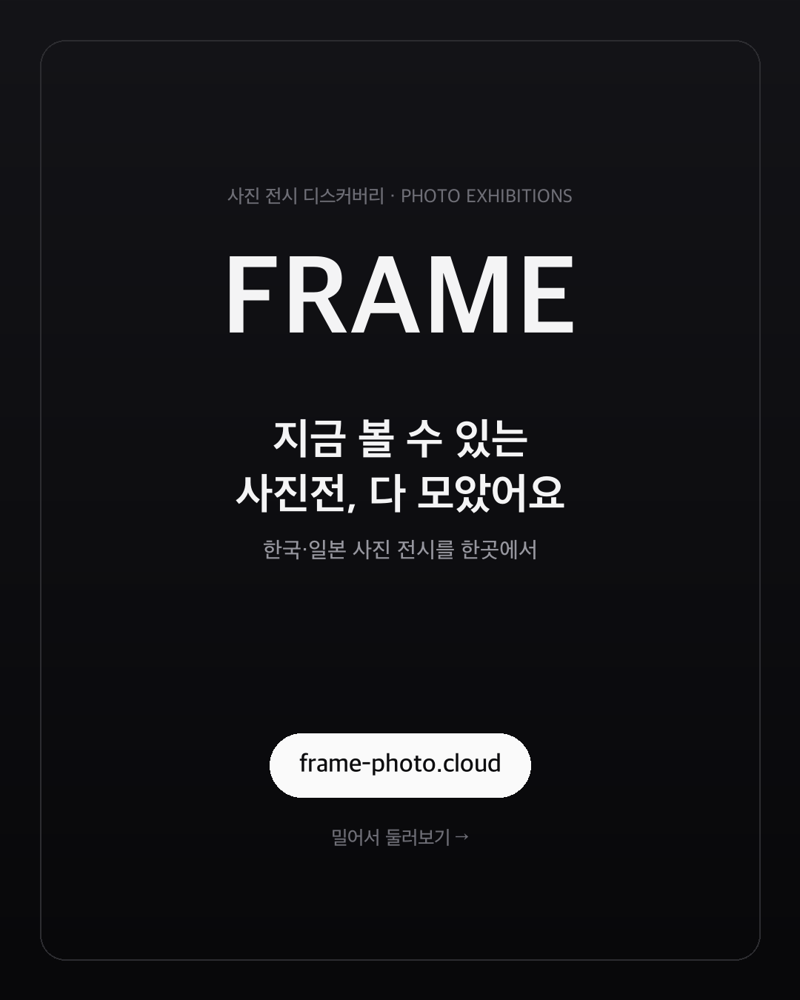
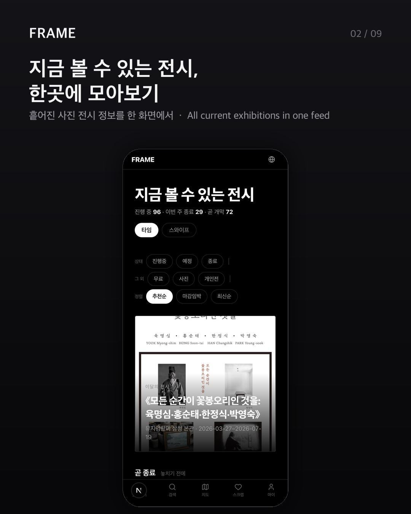
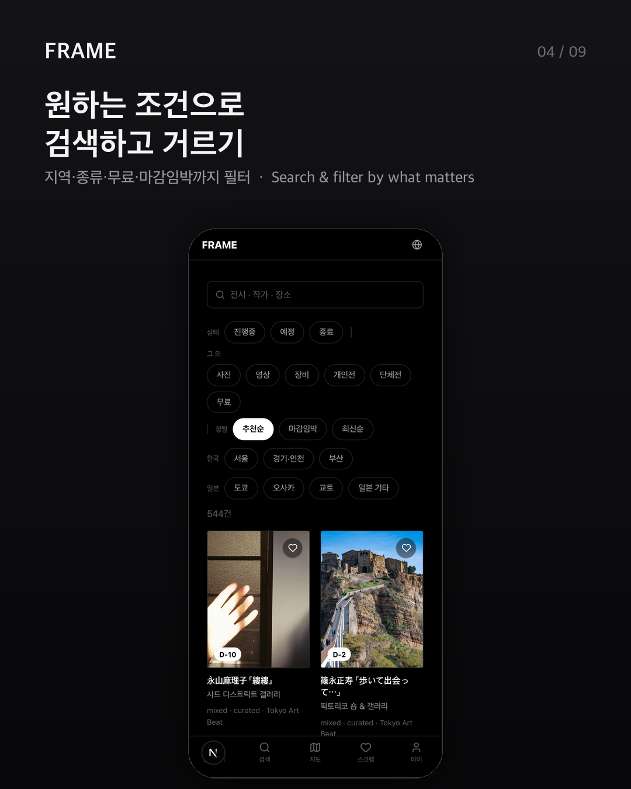
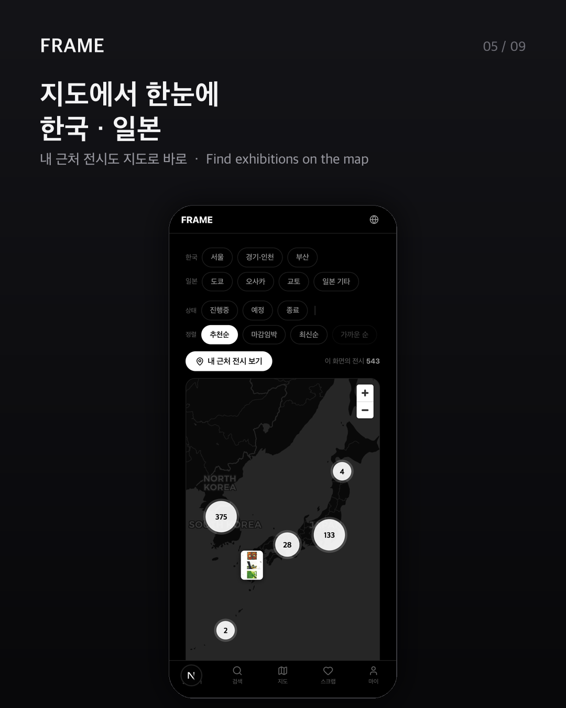

<p align="center">
  
</p>

<h1 align="center">FRAME</h1>

<p align="center">
  <strong>지금 볼 수 있는 한국·일본의 사진·영상 전시를 한곳에.</strong><br>
  <em>All the photo &amp; film exhibitions you can see right now — Korea &amp; Japan, in one feed.</em>
</p>

<p align="center">
  <a href="https://frame-photo.cloud"><b>🌐 frame-photo.cloud</b></a>
  &nbsp;·&nbsp; 🇰🇷 한국어 · 🇺🇸 English · 🇯🇵 日本語
  &nbsp;·&nbsp; 📱 설치형 PWA
  &nbsp;·&nbsp; 💯 완전 무료
</p>

---

흩어져 있던 전시 정보를 모아, **무엇을 볼지 고민하는 시간은 줄이고 좋은 전시는 더 많이** 보도록.
설치 없이 웹에서 바로 쓰고, 홈 화면에 추가하면 앱처럼 동작합니다.

이 저장소는 FRAME을 움직이는 **데이터 파이프라인(크롤러 + 번역 백필)**입니다 —
여러 미술관·아트 사이트를 크롤링해 정규화하고, ko/en/ja로 번역해, 웹 앱이 읽는
정적 카탈로그(`web/public/data/exhibitions.json`)로 내보냅니다.

## 둘러보기

<table>
  <tr>
    <td align="center"></td>
    <td align="center"></td>
    <td align="center"></td>
    <td align="center"></td>
  </tr>
  <tr>
    <td align="center"><sub><b>모아보기</b><br>진행 중인 전시를 한 화면에</sub></td>
    <td align="center"><sub><b>스와이프</b><br>카드 넘기며 관심 전시 찜</sub></td>
    <td align="center"><sub><b>검색·필터</b><br>지역·종류·무료·마감임박</sub></td>
    <td align="center"><sub><b>지도</b><br>한국·일본 전시를 한눈에</sub></td>
  </tr>
</table>

## 기능

| | 기능 | 설명 |
|---|---|---|
| 🗂️ | 모아보기 | 지금 볼 수 있는 전시를 타임라인/스와이프로 |
| 💗 | 찜하기 | 카드처럼 스와이프하며 관심 전시 저장 |
| 🔎 | 검색·필터 | 지역·종류·무료·마감임박으로 거르기 |
| 🗺️ | 지도 | 한국·일본 전시를 지도에서, 내 근처 보기 |
| 🌏 | 3개 언어 | 한국어 · English · 日本語 (전시 정보 자동 번역) |
| 🔔 | 이메일 알림 | 주간 다이제스트 · 마감 임박 · 맞춤 알림 |
| 📲 | PWA 설치 | 홈 화면에 추가해 앱처럼, 완전 무료 |

## 기술 스택

- **크롤러 / 번역 백필** — Python 3.12, Typer CLI, httpx, gspread, Gemini(LLM 번역) + Argos(오프라인 폴백)
- **데이터 저장** — Google Sheets (정규화 5개 워크시트) → 정적 JSON 스냅샷
- **웹 앱** — Next.js (PWA), `frame-photo.cloud`, Supabase(인증·피드백), Amplitude
- **자동화** — GitHub Actions (일일 크롤, 3시간마다 증분 번역, 이메일 발송)
- **운영** — 전부 무료 티어 (개인·비상업 프로젝트)

---

# 개발 문서 (Crawler)

한국·일본 사진/영상/카메라 전시를 크롤링해 Google Sheets 5개 워크시트
(`Exhibitions`, `Artists`, `Venues`, `Organizers`, `_overrides`)에 정규화 저장한다.

## Setup (one-time)

```bash
python3.12 -m venv .venv
source .venv/bin/activate
pip install -e ".[dev]"
```

## Run tests

```bash
pytest -q              # unit + integration (no network)
ruff check src/ tests/
```

## Configure secrets for live crawling

Create a Google Cloud service account, download its JSON key, and share the target sheet with the service-account email as an Editor.

```bash
export SHEET_ID="<your-sheet-id>"
export GOOGLE_SERVICE_ACCOUNT_JSON="$(cat service-account.json)"
export KAKAO_REST_API_KEY="..."
# Optional: LLM translation (Google AI Studio free tier). When set, the
# translation backfill uses Gemini instead of the offline Argos fallback.
export GEMINI_API_KEY="..."              # one key, or several comma-separated (each ideally a separate project) to combine free-tier quotas
export GEMINI_MODEL="gemini-2.5-flash"   # optional override (default shown)
export GEMINI_MIN_INTERVAL_SEC="4.5"     # optional: per-key spacing between calls to stay under the free-tier RPM
```

> **Tip — 번역 처리량 늘리기:** `GEMINI_API_KEY`에 여러 키를 콤마로 넣으면
> (각 키는 별도 무료 프로젝트가 이상적) 키별 라운드로빈으로 분당 한도(RPM)
> 병목이 사실상 사라지고 일일 쿼터도 키 수만큼 합산된다. 백필은 per-day 쿼터가
> 실제로 소진됐을 때만 멈추고, 일시적인 per-minute(RPM) 429나 503은 재시도로
> 흡수하며 계속 진행한다.

## CLI

```bash
crawler init-sheets       # create 5 worksheets with headers (idempotent)
crawler dry-run artmap    # crawl and print normalized JSON, no writes
crawler run artmap        # crawl one source and upsert
crawler run-all           # crawl every registered source
crawler export-json       # write web/public/data/exhibitions.json snapshot
crawler backfill-translations            # fill missing ko/en/ja translations (incremental)
crawler backfill-translations --reset    # clear + rebuild all translations (run once)
```

Translation uses Gemini (LLM) when `GEMINI_API_KEY` is set, else the offline
Argos engine. After switching engines, run the backfill once with `--reset`: it
clears every row's in-scope translations (regardless of the time budget) and
refills what the budget allows. On the free tier a full rebuild can't finish in
one run, so the scheduled `backfill-translations` (every 3h) and the daily
`crawl` job — both incremental — pick up where it left off and converge over the
following runs. The recurring jobs must stay incremental (no `--reset`).

## Adding a new source

1. Write `docs/sources/<name>.md` — list URL, pagination, selectors, quirks.
2. Capture HTML snapshot to `tests/fixtures/<name>/list_page_1.html` and author `expected.jsonl` for the first 3 cards.
3. Implement `src/crawler/sources/<name>.py` with `crawl()` returning `RawExhibition`s and call `register_source(...)` at module bottom.
4. Add `tests/sources/test_<name>.py` mirroring `test_artmap.py`.
5. Add the source value to `SourceName` enum in `models.py` if it's new.

## Currently supported sources

| Name | Type | Status |
|---|---|---|
| `artmap` | aggregator | ✅ |
| `naver` | aggregator | ⚠️ BLOCKED (M3 recon: SPA + IP gating, OAuth route deferred to v1.5) |
| `photo_sema` | museum (Photo SeMA branch only) | ✅ |
| `museum_hanmi` | museum (삼청 + 삼청별관 branches) | ✅ |
| `koba` | expo (annual edition) | ✅ |

## Architecture (one paragraph)

CLI → pipeline → (source extractor → normalizer → entity resolver → geocoder → sheets writer). Each stage is independently testable; sources only know HTTP/HTML, normalizers are pure functions, the resolver only talks to the sink via the Repository protocol, and the gspread implementation is one of two repositories (the other is in-memory for tests).

See `docs/superpowers/specs/2026-05-28-photo-exhibition-crawler-design.md` for full design.

## 피드백 제보 (Supabase Edge Function)

마이페이지의 버그·피드백 폼은 `supabase/functions/feedback` Edge Function을 통해
Resend로 메일을 보낸다. 클라이언트는 로그인 JWT로만 호출할 수 있다(verify_jwt 기본 활성).

### 시크릿 설정 (한 번)

    supabase secrets set RESEND_API_KEY=re_xxx
    supabase secrets set FEEDBACK_TO=you@example.com
    supabase secrets set FEEDBACK_FROM="FRAME <notify@frame-photo.cloud>"
    # 선택: 허용 오리진 (기본 https://frame-photo.cloud,http://localhost:3000)
    supabase secrets set FEEDBACK_ALLOWED_ORIGINS="https://frame-photo.cloud"

`FEEDBACK_FROM`의 도메인은 Resend에서 검증된 발신 도메인이어야 한다.

### 배포

    supabase functions deploy feedback

JWT 검증은 `supabase/config.toml`의 `[functions.feedback] verify_jwt = true`로
고정되어 있다. 배포 기본값에 의존하지 않으며 `--no-verify-jwt`는 금지.

### 로컬 테스트

    cd supabase/functions/feedback && deno test
